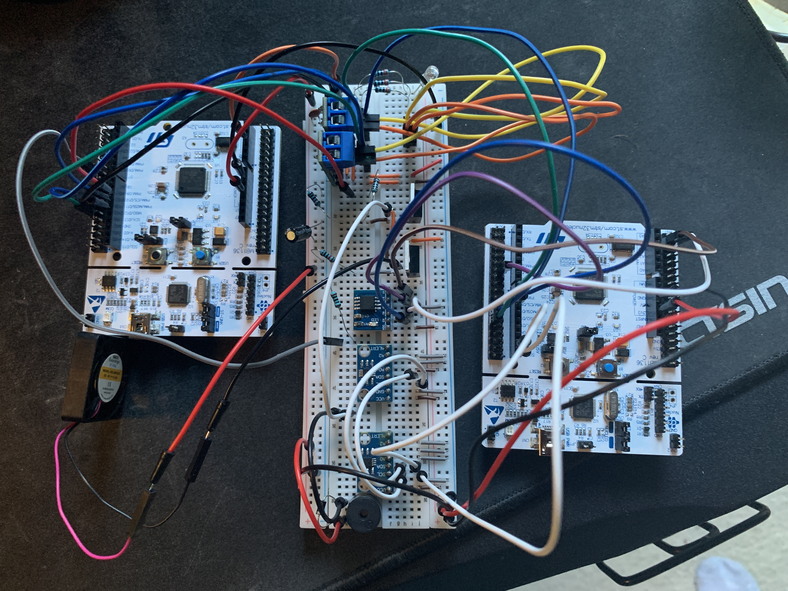

# Embedded Vehicle Health Controller

A two-node STM32 embedded C++ project that models a distributed vehicle-health and thermal-control system.

Board 1 monitors redundant temperature sensors, manages faults, stores persistent diagnostic events in external SPI flash, reports telemetry over UART, and sends vehicle-health data over CAN. Board 2 receives that data, supervises communication, and controls a cooling fan, RGB warning LED, and passive buzzer.

The system is built around two STM32 NUCLEO-F446RE boards using STM32CubeMX/HAL for hardware initialization and separate application-owned C++ layers for the project logic.

## Hardware and Demo

[](https://youtu.be/bwHnzXgaVg4)

**Demo:** [Watch the full hardware demonstration](https://youtu.be/bwHnzXgaVg4)

## Highlights

### Board 1 — Vehicle Health Controller

- Dual MCP9808 temperature sensors over I²C
- Redundant, degraded, disagreement, and unavailable temperature modes
- Overtemperature and sensor fault monitoring
- Active and latched fault masks
- Independent watchdog and reset-cause reporting
- W25Q64 SPI flash with persistent diagnostic logging
- UART telemetry and diagnostic commands
- Periodic `0x100` Vehicle Health Status CAN transmission
- Reception and supervision of Board 2 `0x101` Thermal Actuator Status
- Detection and logging of remote-node communication loss

### Board 2 — Thermal / Actuator Controller

- Receives and validates Board 1 vehicle-health CAN frames
- Thermal states: `NORMAL`, `WARM`, `COOLING`, `HIGH`, `CRITICAL`, and `SAFE`
- PWM cooling-fan control
- PWM RGB warning LED
- Passive-buzzer warning patterns
- Non-blocking actuator self-test from the USER button
- Independent watchdog supervision
- Periodic `0x101` actuator-status feedback to Board 1
- Automatic CAN recovery after startup or transport errors

## System Architecture

```text
BOARD 1 — Vehicle Health Controller
        │
        ├── MCP9808 Sensor A ─┐
        ├── MCP9808 Sensor B ─┴─ I²C
        ├── Temperature Health Monitoring
        ├── Fault Manager
        ├── Independent Watchdog
        ├── W25Q64 Diagnostic Logger ─ SPI
        ├── UART Diagnostics
        └── CAN1
             │
             │  0x100 Vehicle Health Status
             ▼
        SN65HVD230
             │
          CANH/CANL
             │
        SN65HVD230
             ▲
             │  0x101 Thermal Actuator Status
             │
BOARD 2 — Thermal / Actuator Controller
        │
        ├── CAN Communication Supervision
        ├── Thermal State Machine
        ├── Fan PWM
        ├── RGB LED PWM
        ├── Passive Buzzer PWM
        ├── USER-Button Actuator Self-Test
        └── Independent Watchdog
```

## CAN Communication

Both boards use CAN1 in normal mode at **500 kbit/s** through SN65HVD230 transceivers.

```text
PA11 = CAN1_RX
PA12 = CAN1_TX
```

The two transceiver boards provide 120-ohm termination at each end of the bus, producing approximately 60 ohms across CANH and CANL with the system powered off.

### Board 1 → Board 2

```text
Standard ID: 0x100
Period:      500 ms
Length:      8 bytes
```

The frame contains:

- protocol version
- system-health and sensor-validity flags
- selected temperature in 0.1°C
- active fault mask

### Board 2 → Board 1

```text
Standard ID: 0x101
Period:      500 ms
Length:      8 bytes
```

The frame contains:

- Board 2 operational/communication flags
- thermal-control state
- fan duty percentage
- warning-color code
- buzzer-pattern code

Board 2 considers Board 1 communication lost after **2500 ms** without a valid health frame and enters `SAFE`.

Board 1 considers a previously connected Board 2 lost after **2500 ms** without a valid actuator-status frame. This raises fault bit:

```text
0x00000040 — Remote actuator communication lost
```

If Board 1 has never seen Board 2 since startup, the state remains `WAITING_FOR_DATA` rather than immediately raising that fault.

## Temperature Monitoring

Board 1 uses two MCP9808 sensors on the same I²C bus:

```text
Sensor A: 0x18
Sensor B: 0x19
```

The temperature monitor supports:

```text
REDUNDANT      both sensors valid and in agreement
DEGRADED_A     only Sensor A is valid
DEGRADED_B     only Sensor B is valid
DISAGREEMENT   both valid but differ too much
UNAVAILABLE    neither sensor is usable
```

Current bench thresholds:

```text
Sensor disagreement: 2.0°C
Overtemperature:    60.0°C
```

These are project demonstration thresholds, not validated vehicle safety limits.

## Thermal / Actuator Policy

Board 2 maps the trusted temperature state into physical outputs:

```text
State       Fan      RGB       Buzzer
------------------------------------------
NORMAL      0%       GREEN     OFF
WARM        0%       YELLOW    OFF
COOLING     40%      BLUE      OFF
HIGH        70%      ORANGE    SLOW_BEEP
CRITICAL    100%     RED       FAST_BEEP
SAFE        100%     MAGENTA   FAULT
```

`SAFE` intentionally requests full cooling when required remote temperature data is stale or unavailable.

The RGB LED and fan share TIM3 PWM channels. The passive buzzer uses TIM4 so its audio-frequency PWM remains independent of the fan and LED timing.

The Board 2 USER button starts a non-blocking actuator self-test that cycles the fan, RGB LED, and buzzer while CAN servicing and watchdog supervision continue in the background.

## Persistent Diagnostic Logging

Board 1 stores structured diagnostic records in the first two sectors of a W25Q64 SPI flash.

Current event types:

```text
1 = SystemStartup
2 = FaultActivated
3 = FaultCleared
```

The logger scans flash during startup and reconstructs the existing record history before appending the new startup event.

Fault records store both the fault bits that changed and the complete active fault mask after the transition.

The remote-node communication fault uses the same logging path as other system faults, so disconnecting and reconnecting Board 2 produces normal activation and recovery records.

The UART command:

```text
LOG ERASE
```

erases the diagnostic-log region when a clean history is needed.

## Watchdog and Recovery

Both boards use independent watchdog supervision.

Board 1 normally refreshes the watchdog every 500 ms. The command:

```text
WATCHDOG TEST
```

intentionally stops watchdog refreshing. After approximately two seconds, the MCU resets, and the next telemetry output reports the watchdog as the reset cause.

Board 2 also monitors CAN state and performs bounded recovery attempts if the CAN peripheral is no longer listening, allowing it to recover without requiring a manual reset.

## UART Diagnostics

Both boards use USART2 through the ST-LINK virtual COM port:

```text
115200 baud
8 data bits
No parity
1 stop bit
No flow control
```

Board 1 sends telemetry once per second and supports commands including:

```text
STATUS
FAULTS
RESET CAUSE
TEMPERATURES
FLASH STATUS
FLASH TEST
LOG ERASE
CAN TEST
INJECT BUTTON FAULT
INJECT TIMER FAULT
CLEAR INJECTED FAULTS
CLEAR FAULTS
WATCHDOG TEST
```

## Hardware

### Board 1

- STM32 NUCLEO-F446RE
- 2× MCP9808 temperature sensors
- W25Q64 SPI flash
- Waveshare SN65HVD230 CAN transceiver
- Breadboard and jumper wiring

### Board 2

- STM32 NUCLEO-F446RE
- Waveshare SN65HVD230 CAN transceiver
- Common-cathode RGB LED
- 5 V brushless cooling fan
- Passive buzzer
- 2× logic-level N-channel MOSFET switching stages
- Gate resistors and pull-down resistors
- Fan-supply decoupling capacitors
- 1N4007 protection diode across the buzzer load

The MOSFETs allow low-current STM32 PWM signals to control the fan and buzzer loads without driving those loads directly from GPIO pins.

## Repository Structure

```text
EmbeddedVehicleHealthController/
├── Board1_VehicleHealthController/
│   ├── App/
│   ├── Core/
│   ├── Drivers/
│   └── EmbeddedVehicleHealthController.ioc
├── Board2_ThermalActuatorController/
│   ├── App/
│   ├── Core/
│   ├── Drivers/
│   └── Board2_ThermalActuatorController.ioc
├── Shared/
│   └── Inc/
│       └── CanProtocol.hpp
├── .gitignore
└── README.md
```

## Verified Behavior

The completed bench prototype has been used to verify:

- redundant I²C temperature acquisition
- SPI flash identification, erase, program, read, and persistent logging
- physical bidirectional CAN communication at 500 kbit/s
- Board 2 thermal-state and actuator control
- RGB LED, fan, and buzzer PWM output
- non-blocking Board 2 actuator self-test
- CAN communication-loss detection and automatic recovery
- Board 1 `0x40` remote-node fault activation and clearing
- persistent logging of fault activation and recovery
- watchdog-triggered reset and reset-cause reporting
- both STM32 firmware projects building independently

## Design Principles

- Keep generated STM32 hardware code separate from application-owned C++.
- Keep shared CAN protocol definitions in one place.
- Avoid dynamic allocation and use bounded buffers.
- Keep interrupt handlers short and normal scheduling non-blocking.
- Separate hardware drivers, communication transport, state machines, and application policy.
- Keep active faults separate from latched fault history.
- Preserve diagnostic history in external flash across resets.
- Fail the actuator controller to a conservative `SAFE` state when required remote data becomes stale.
- Keep actuator self-tests non-blocking so communication and watchdog servicing continue.
- Use MOSFET switching stages for loads that should not be driven directly from STM32 GPIO.
